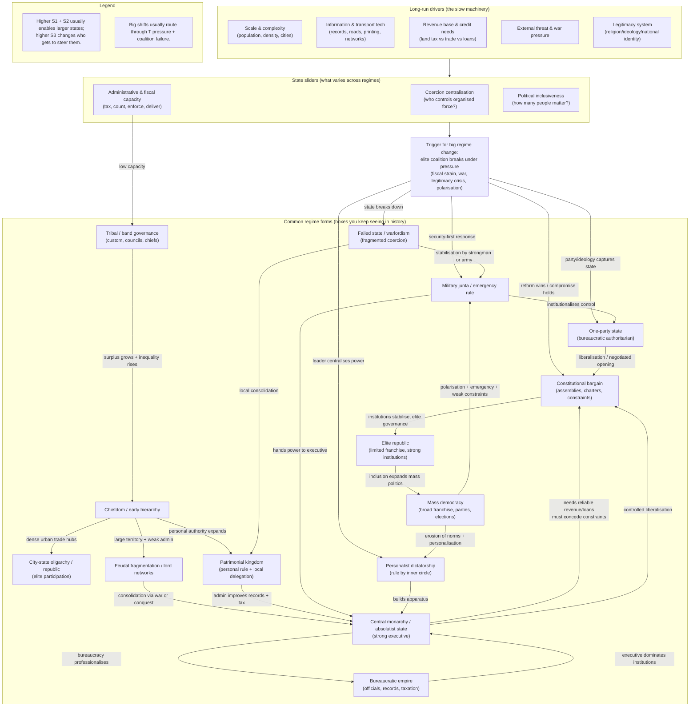

# Regime-Change Model

Reference diagram: long-run drivers, state “sliders”, trigger for regime change, and common regime forms with baseline paths and crisis-driven shifts.

```mermaid
flowchart TB

%% -------------------------
%% DRIVERS -> SLIDERS
%% -------------------------
subgraph D["Long-run drivers (the slow machinery)"]
direction TB
D1["Scale & complexity<br/>(population, density, cities)"]
D2["Information & transport tech<br/>(records, roads, printing, networks)"]
D3["Revenue base & credit needs<br/>(land tax vs trade vs loans)"]
D4[External threat & war pressure]
D5["Legitimacy system<br/>(religion/ideology/national identity)"]
end

subgraph S["State sliders (what varies across regimes)"]
direction TB
S1["Coercion centralisation<br/>(who controls organised force?)"]
S2["Administrative & fiscal capacity<br/>(tax, count, enforce, deliver)"]
S3["Political inclusiveness<br/>(how many people matter?)"]
end

D --> S

T["Trigger for big regime change:<br/>elite coalition breaks under pressure<br/>(fiscal strain, war, legitimacy crisis, polarisation)"]
S --> T

%% -------------------------
%% REGIME FORMS (NODES)
%% -------------------------
subgraph R["Common regime forms (boxes you keep seeing in history)"]
direction TB

R0["Tribal / band governance<br/>(custom, councils, chiefs)"]
R1[Chiefdom / early hierarchy]
R2["City-state oligarchy / republic<br/>(elite participation)"]
R3[Feudal fragmentation / lord networks]
R4["Patrimonial kingdom<br/>(personal rule + local delegation)"]
R5["Bureaucratic empire<br/>(officials, records, taxation)"]
R6["Central monarchy / absolutist state<br/>(strong executive)"]
R7["Constitutional bargain<br/>(assemblies, charters, constraints)"]
R8["Elite republic<br/>(limited franchise, strong institutions)"]
R9["Mass democracy<br/>(broad franchise, parties, elections)"]
R10["One-party state<br/>(bureaucratic authoritarian)"]
R11[Military junta / emergency rule]
R12["Personalist dictatorship<br/>(rule by inner circle)"]
R13["Failed state / warlordism<br/>(fragmented coercion)"]
end

%% -------------------------
%% BASELINE "LIKELY" PATHS
%% -------------------------

%% Early scale / low capacity
S2 -->|low capacity| R0
R0 -->|surplus grows + inequality rises| R1

%% Trade/urban versus land/territory branching
R1 -->|dense urban trade hubs| R2
R1 -->|large territory + weak admin| R3
R1 -->|personal authority expands| R4

%% Empire / centralisation routes
R3 -->|consolidation via war or conquest| R6
R4 -->|admin improves records + tax| R6
R6 -->|bureaucracy professionalises| R5
R5 -->|executive dominates institutions| R6

%% Bargains to raise revenue / credibility
R6 -->|needs reliable revenue/loans<br/>must concede constraints| R7
R7 -->|institutions stabilise, elite governance| R8
R8 -->|inclusion expands mass politics| R9

%% -------------------------
%% CRISIS-DRIVEN SHIFTS
%% -------------------------
T -->|state breaks down| R13
T -->|security-first response| R11
T -->|party/ideology captures state| R10
T -->|leader centralises power| R12
T -->|reform wins / compromise holds| R7

%% -------------------------
%% COLLAPSE / RECOVERY LOOPS
%% -------------------------
R13 -->|stabilisation by strongman or army| R11
R13 -->|local consolidation| R4
R11 -->|institutionalises control| R10
R11 -->|hands power to executive| R6
R12 -->|builds apparatus| R6
R10 -->|liberalisation / negotiated opening| R7
R6 -->|controlled liberalisation| R7
R9 -->|polarisation + emergency + weak constraints| R11
R9 -->|erosion of norms + personalisation| R12

%% -------------------------
%% LEGEND (mini)
%% -------------------------
subgraph L[Legend]
direction TB
L1["Higher S1 + S2 usually enables larger states;<br/>higher S3 changes who gets to steer them."]
L2[Big shifts usually route through T pressure + coalition failure.]
end
```
